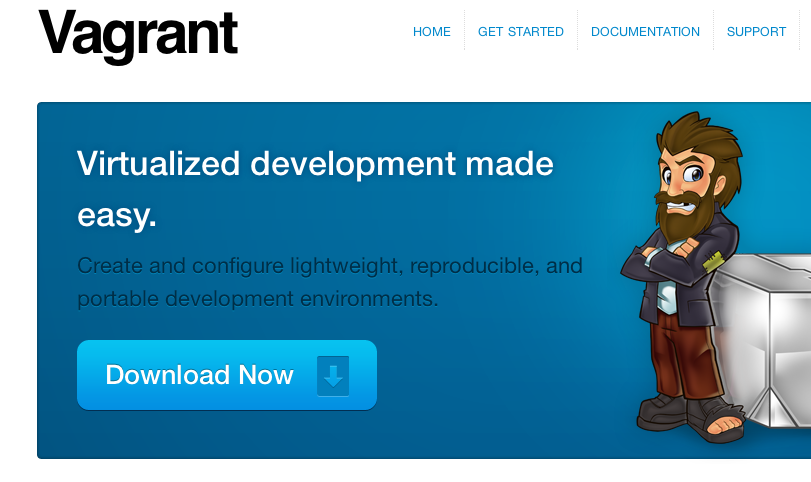

!SLIDE 
# Vagrant #
### anders.janmyr@jayway.com
### http://anders.janmyr.com
### @andersjanmyr

!SLIDE center

!SLIDE bullets 
# What is Vagrant?

* Wrapper around Virtual Box
* Simplified VM Management

!SLIDE bullets small
# Installation

## Install Virtual Box

* http://www.virtualbox.org/

## Install Vagrant

* `gem install vagrant`
* http://downloads.vagrantup.com/tags/v1.0.2

!SLIDE commandline incremental
# Add a box

    $ vagrant box add lucid32 http://files.vagrantup.com/lucid32.box
    ...
    Downloading box....
    ....
    Adding box....

!SLIDE commandline incremental
# `vagrant init` 

    $ vagrant init lucid32
    A `Vagrantfile` has been placed in this directory. You are now
    ready to `vagrant up` your first virtual environment! Please read
    the comments in the Vagrantfile as well as documentation on
    `vagrantup.com` for more information on using Vagrant.

!SLIDE commandline incremental
# Start it up

    $ vagrant up
    [default] VM already created. Booting if it's not already running...
    [default] Clearing any previously set forwarded ports...
    [default] Forwarding ports...
    [default] -- 22 => 2222 (adapter 1)
    [default] -- 80 => 8080 (adapter 1)
    [default] Creating shared folders metadata...
    [default] Clearing any previously set network interfaces...
    [default] Running any VM customizations...
    [default] Booting VM...
    [default] Waiting for VM to boot. This can take a few minutes.
    [default] VM booted and ready for use!
    [default] Mounting shared folders...
    [default] -- v-root: /vagrant

!SLIDE commandline incremental
# Use it `vagrant ssh`

    $ ls            # osx
    Vagrantfile README.md

    $ vagrant ssh   # osx
    Welcome to Ubuntu 11.10 (GNU/Linux 3.0.0-12-server x86_64)
    ...

    $ cd /vagrant   # linux

    $ ls            # linux
    Vagrantfile README.md
    # The directory is automatically mounted

!SLIDE 

# Demo

!SLIDE smaller
# Vagrantfile

    @@@ruby
    Vagrant::Config.run do |config|
      config.vm.box = "framtidslyftet"

      config.vm.box_url = "https://s3-eu-west-1.amazonaws.com/anders-vagrant/framtidslyftet.box"

      config.vm.forward_port 80, 8080

      # Set 1GB of memory
      Vagrant::Config.run do |config|
        config.vm.customize ["modifyvm", :id, "--memory", 1024]
      end
       ...
    end

!SLIDE commandline incremental
# `vagrant package`

    $ vagrant package --output framtidslyftet.box
    [default] Attempting graceful shutdown of VM...
    [default] Clearing any previously set forwarded ports...
    [default] Creating temporary directory for export...
    [default] Exporting VM...
    [default] Compressing package to: /Users/andersjanmyr/Projects/framtidslyftet/framtidslyftet.box
